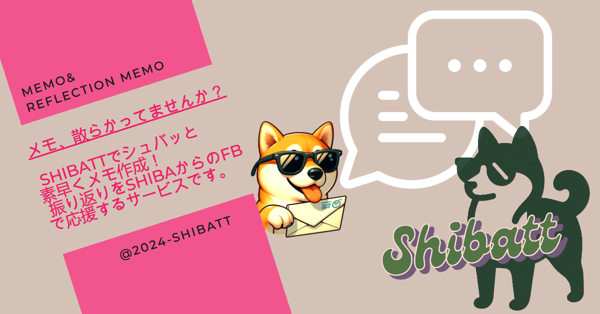

# Shibatt

---
### ■サービスURL
https://www.memo-shibatt.com/
- LINEを使用したサービスのため、 **公式LINEチャンネル"Shibatt"「友達登録」を推奨**しております
- ユーザー名とパスワードで簡単にログインも可能です

### ■サービス概要
- メモを作成し、さらにアウトプットするためのサービスです
- インプットした内容や、アイデア・感情など自分の言葉で素早くメモを残せます
- さらに書きっぱなしにせず、振り返りメモを作成を促し、FBで応援します

### ■ このサービスへの思い・作りたい理由
- 今までメモやTIL、SNSなど自分の言葉でアウトプットしてきたが、書きっぱなしになっていた
- 何かと慌ただしい日々でもインプットにとどまらず振り返り、自分と向き合う時間を確保したい
- 学習内容、自己分析、セルフメンタルケアに使えるアプトプットツールを作りたい　

### ■ ユーザー層について
- スマホで思いつきメモを気軽に残し、活用したい人 
  - 日常の思いつきを、日常使用するツールで書き留められるようLINE友達登録を推奨
  - スマホでの使用を想定しており、レスポンシブ対応
- アウトプットを効率良く、継続したい人 
  - 先週作成したメモをまとめて振り返る機能で忙しい日々でも効率的にアウトプット

### ■サービスの利用イメージ

| トップ画面 | 新規ユーザー登録 | ログイン |
| --- | --- | --- |
| |  |  |

| メモ作成 | | |
| --- | --- | ---- |
| (1)LINEからメモ作成 | (2)アプリからメモ作成 | メモ一覧 |
|  |  |  |

| 振り返りメモ |  |  |
| --- | --- | --- |
| 振り返りメモ作成 | (1)LINEに フィードバックが届く | (2)フィードバックを アプリで確認 |
|  |  |  | 
----

### ■ ユーザーの獲得について
- X共有機能による宣伝
  ：振り返りメモ作成後に届くフィードバック時に「Xで共有」ボタンを表示

### ■ サービスの差別化ポイント・推しポイント
- **LINEと連携したスマホファースト** 
  日常使用しているLINEからアプリへの動線をスムーズに、スマホユーザーの使いやすさを追求しました。推しポイントはLINEのトーク画面に表示されている**"リッチメニュー"**です！アプリへ自動ログイン、アウトプット達成度の可視化や困った際の使い方・問い合わせフォームへリンクが可能です！

  

  | 自動ログイン | 達成率の可視化 | 困ったとき |
  | --- | --- | --- |
  |  |  |  |

 

- **振り返りをサポート** 
あとでまとめよう、日曜日にまとめてやろう...と言ってそのままにしないようサポートします。

  
  
  **「先週のメモを振り返る」** 
  先週作成したメモのうち、アウトプットしていないものをまとめて紐付けます。

  **「Shibaから応援」** 
  振り返りメモを作成し、アウトプットが終わるとShibaからフィードバックがLINEへ届きます。

### 今後の展望
- アウトプットをもっと自然に
  - 作成したメモが一定数溜まったらLINEへ通知
- PCからの利用
  - メモ内容はマークダウンを採用し、見やすいメモ作成をサポート
### 技術スタック

| category | 技術 |
| --- | --- |
| Frontend | Rails 7.1.3.2 (Hotwire/Turbo), TailwindCSS, DaisyUI |
| Backend | Rails 7.1.3.2 (Ruby 3.2.2 ) |
| Infrastructure | heroku |
| Database | Mysql2,jawsDB |
| Environment setup | Docker |
| CI/CD | GitHub Actions |
| Design | Figma,dbdiagram |
| Authentication | sorcery |
| Web API | LINE Messaging API、OpenAI API |

#　画面遷移図

# ER図

